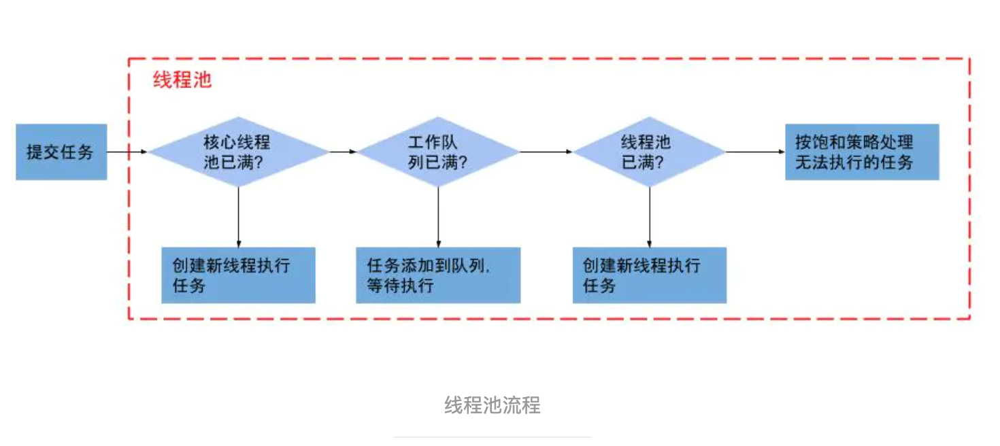

# 第三章


#### sleep、wait、join、yield

1. 锁池：竞争同步锁的线程会放到锁池
2. wait：线程会进入等待池，notify 随机释放一个线程，如果线程处于同步锁机制中就会进入锁池，否则直接进入就绪态
3. sleep 是 Thread 的静态本地方法，wait 是 Object的本地方法
4. sleep 不会释放锁，同步机制下，非同步机制无需获得锁，就没有释放锁之说
5. sleep 不依赖同步机制，wait 依赖 synchronized 机制
6. sleep 不需要被唤醒，wait 需要
7. sleep 用于线程休眠，轮询，wait 用于线程间通信
8. sleep会让出 CPU并且强制上下文切换，wait 不一定，wait 后可能被马上唤醒
9. yield 让步，执行后直接让线程进入就绪状态，如果在运行，马上放弃 CPU
10. join：线程 B 执行了线程 A.join，线程 B 进入阻塞直到线程 A 执行完，相当于执行 join 的线程加入到调用 join 的线程之后执行


#### 线程安全

1. 堆的对象线程共享
2. 栈：每个线程独有，OS 切换线程时自动切换栈
3. 多个线程访问同一个对象，如果不进行同步机制的情况下调用对象的方法都能获得正确的结果，称这个对象是线程安全的


#### Thread 、Runable

1. Thread 是线程类，Runable 是可运行线程对象
2. Runable 可以将线程的实现和线程执行的业务解耦
3. Runable 实现类对象作为参数传入 Thread 构造方法才能使用


#### 守护线程

1. 是所有非守护线程的守护线程，对所有非守护线程服务
2. 非守护线程都执行完，守护线程自动挂掉
3. 生命周期不可控，所以IO、file 操作不要分配给守护线程
4. 作用：GC 线程
5. 运行中的线程不能设置为守护线程
6. java ExecutorService会将守护线程转为用户线程


#### ThreadLocal

1. 线程间数据隔离

2. 对象跨层传递时，可以避免多次传递，打破层次 间的约束

3. 事务控制，存储线程事务信息

4. 数据库连接、session会话管理等

5. spring事务管理默认给当前线程绑定一个 JDBC Connection，事务过程中都是使用线程绑定的Connection，实现事务的隔离性，使用了 ThreadLocal

6. 数据同步，并发量大时，不使用事务

7. 原理

   1. ```java
      ThreadLocal.ThreadLocalMap threadLocals = null;
      // Thread 类中，threadLocals是 ThreadLocal 的内部类 ThreadLocalMap
      ```

   2. 一个线程一个ThreadLocalMap，一个ThreadLocalMap只存一个键值对Entry（弱引用），key 就是 ThreadLocal 对象，value 就是 set 方法的参数

   3. get方法先返回当前线程的 ThreadLocalMap 对象，然后获取 Entry 的 value

   4. ```java
      static class Entry extends WeakReference<ThreadLocal<?>> {
          /** The value associated with this ThreadLocal. */
          Object value;
      
          Entry(ThreadLocal<?> k, Object v) {
              super(k);
              value = v;
          }
      }
      ```

      ThreadLocalMap的核心属性 Entry 是弱引用，在 GC 时会被回收

   5. 如果一个ThreadLocal不存在外部**强引用**时，Key(ThreadLocal)势必会被GC回收，这样就会导致ThreadLocalMap中key为null， 而value还存在着强引用，只有thead线程退出以后,value的强引用链条才会断掉。但如果当前线程再迟迟不结束的话，这些key为null的Entry的value就会一直存在一条强引用链。永远无法回收，造成内存泄漏。


#### ThreadLocal 内存泄露

1. 不会被使用的对象或变量占用的内存无法被 回收，就是内存泄露
2. 强引用：new 、反射创建的对象，一个对象**具有**强引用，JVM 即便内存溢出也不会回收该对象, 并不代表其变成游离对象不回收
3. ThreadLocalMap的 key 为弱引用
4. ThreadLocalMap的生命周期和 Thread 一样长，没有手动删除对应的 key就会导致内存泄露，而不是弱引用的原因
5. 正确用法
   1. 使用完就 remove，清除数据
   2. ThreadLocal 变量定义为 private static，这样就一直存在 ThreadLoca强引用
   3. ThreadLocalMap与Thread的生命周期是一样长，如果都没有手动删除对应key，都会导致内存泄漏。
   4. 弱引用ThreadLocal不会内存泄漏，对应的value在下一次ThreadLocalMap调用set(),get(),remove()的时候会被清除。


#### 并行、并发、串行

1. 并行：多个线程同一时刻互不干扰的执行，多个线程运行在多个 CPU 上
2. 并发：多个线程交替执行，CPU 轮转，对于 CPU 而言是串行，多个线程在一个 CPU 上交替执行
3. 串行：单线程执行


#### 并发三大特性

1. 原子性
   1. i++执行4流程，前三个流程可以设定原子性
      1. 将 i 从主存（堆）读到工作内存（栈，局部变量表）
      2. i+1运算（CPU，操作数栈）
      3. 将结果写到工作内存（栈，局部变量表）
      4. 将工作内存中的值回写到主存，时机有操作系统决定，不确定
   2. 可见性
      1. 将结果写到工作内存（栈，局部变量表）和 将工作内存中的值回写到主存两个流程是原子性的
      2. 线程 A对 i 执行3、4 流程时，线程 B中的 i 会被通知修改
   3. 有序性
      1. 指令重排（单线程情况对结果无影响 会进行）在多线程环境导致问题
      2. 使用 synchronized 禁止指令重排
      3. new 对象三步骤
         1. 申请堆内存空间
         2. 对象赋初值
         3. 对象地址赋值给引用
         4. 多线程环境可能导致对象没内赋初值就被引用

#### 线程池

1. 降低资源消耗，提高线程李利用率，降低创建和销毁线程的消耗
2. 提高响应速度，任务来了，直接有线程使用，而不是先创建线程
3. 提高可管理性，线程统一调配监控
4. 线程池参数
   1. corePoolSize
   2. MaxinumPoolSize
   3. keepAliveTime
   4. workQueue
   5. handler


#### 线程池执行流程




#### 线程池阻塞队列的作用

1. 普通队列入队超过了长度，入队任务会丢失，阻塞队列可以通过线程阻塞保留住当前想继续入队的任务，以便开启最大线程执行
2. 阻塞队列可以让核心线程在没有任务时就如 wait，释放 CPU
3. 阻塞队列自带唤醒线程功能


#### 为什么先添加队列再创建最大线程

1. 首先任务队列可以提高核心线程的工作饱和度
2. 创建线程影响整体效率


#### 线程复用原理

1. 线程池将线程和任务解耦，摆脱了一个 Thread必须对应一个任务的限制
2. 线程池中一个线程不断的从阻塞队列中获取新任务来执行
3. 并不是每次执行任务就 Thread.start()，这会派生线程，而是让线程执行循环任务，不停的检测是否有任务需要执行
4. 如果有就执行，调用 run 方法执行，这样讲所有任务的 run 方法串联起来

